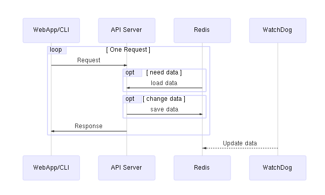

Development documents for DataMark
===================================

Concept
--------

- Data
  - Files in FileSystem
  - with properties (tags, comment)
- Assembly
  - assemblies of Data and Assembly
  - with properties

Backend
--------

Implementations (TODOs)
------------------------

- Save properties
  - [ ] Redis
- Browse+Edit Data & Assembly
  - [ ] API Server
  - [ ] WebApp
  - [ ] CLI (datamarker)
- Watch Filesystems
  - [ ] watchdog server
